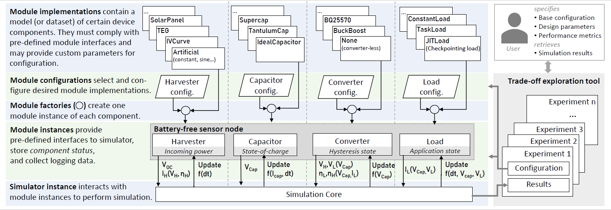

### Architecture

*Simba* features a modular architecture that allows to use and configure different component implementations in a plug-and-play manner, while using the same simulation core. The overall architecture is shown below and described in more detail in our [paper](TODO).


### Implementation

The interactions and dependencies between the device components - as detailed in  [[Simulation principle]] - are accounted for in the main simulator class using the following procedure:        

``` 
Reset all modules to start condition
t = 0

For each simulation step until t = tmax:

	Vcap = f(Capacitor)
	
	Voc = f(Harvester, t)
	Vin = f(Converter, Vcap, Voc)
	Iin = f(Harvester, t, Vin)
	Ein = f(Converter, Vin, Iin)
	
	Vout = f(Converter, Vcap)
	Iout = f(Load, Vout, Vcap) 
	Eout = f(Converter, Vcap, Iout)
	Iquiescent = f(Converter, Vcap)
		
	Itotal = Iin * Vin / Vcap * Ein - Iout * Vout / Vcap / Eout - Iquiescent
	dt = f(Converter, Load, Harvester)
	
	Update Capacitor according to: f(Capacitor, Itotal, dt)
	Update Harvester according to: f(Harvester, dt, Vin)	
	Update Converter according to: f(Converter, dt, Vcap)
	Update Load according to: f(Load, Vcap, Vout, dt)
	
	t = t + max(t_min, min(dt, t_max))
```

The values required in the simulation core (`Vin`, `In`, etc.) are depending on the module implementation. The different modules (i.e., `Harvester`, `Converter`, `Load`, `Capacitor`) have to implement pre-defined interfaces, such that different module implementations can be selected and simulated in a plug-and-play manner, using the same underlying simulation principle. For more information on the module interfaces and their configuration, see [[Module implementations]].

***Discrete time `t` and Timestep `dt`***

*Simba* adopts a discrete-time simulation, i.e., the time `t` is represented in integer values, with a configurable, minimum timestep of `t_min` (the default value is $1 \mu s$.) 

To increase simulation speed, the timestep `dt` is variable for each simulation step and is commonly set to the time until the next event (i.e., state-change due to capacitor voltage) of any of the submodules: `dt_modules = f(Converter, Load, Harvester)`.
Each module has to notify the simulation core at which point in time (if any), they expect the next change in their state. 

For example:

 - The `Converter` state (`Ein, Eout, Vout, Vin`) can change if the capacitor voltage reaches certain thresholds.
 - The `Load` state (`Iout`) can change depending on the implemented Load/Application over time (e.g., different tasks might exhibit different power consumptions).
 - The `Harvester` state can change over time due to environmental changes (i.e., solar traces, temperature changes etc.), or if the capacitor voltage changes (i.e., I-V characteristics of certain harvesters).

Additionally, to increase simulation accuracy, a maximum timestep `t_max` can be configured, to force a simulation round even before one the modules registered an update (i.e.,  `dt = min(t_max, dt_modules)`).

### Logging and performance metrics

**Logging.** *Simba*'s logging is performed on two layers:

- The simulation core can be instructed to log high-level information (i.e., any value that is used in the simulation core's algorithm above). This allows to easily compare different designs, regardless of the underlying device components (i.e., module implementations). To save storage space and speed up the simulations, the simulation core can be instructed to store only certain values (e.g., `log_keys = [<VALUE_NAMES>]` ) and only if certain values change (e.g., `log_triggers = [<VALUE_NAMES>]`).
- Each module implements its own logging functions, that is triggered within the module's `update_state` function and stores data along with a *global timestamp*. The data can be retrieved once the simulation has finished and can then be post-processed (i.e., merged). Using this structure, the level of detail of logging information is up to the module developer and can be easily extended if required. 

**Performance metrics.** Based on its stored logs, each module can further derive its own performance metrics which are made available to the [[Trade-off exploration]] tool. They are also implemented on a module implementation level, as these metrics can be highly application/module specific. For example, harvester modules might derive the actual and maximum available energy, while load modules can derive very detailed statistics such as the number of executed tasks, experienced power failures etc.

