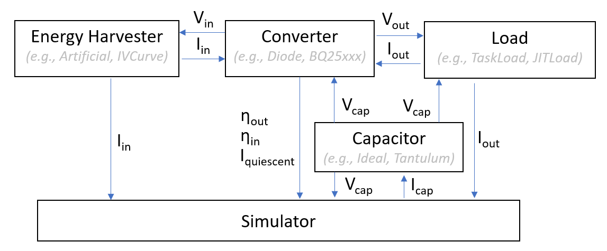

*Simba* allows to simulate the behavior of a battery-free sensor node that consists of

- an energy harvester
- a converter
- an energy buffer (capacitor)
- a load (e.g., MCU and sensors)

*Simba* accounts for any energy-related dependencies between these sensor node components (as sketched below) using fixed interfaces. This allows to plug in different implementations/models/data set for each component and thus a variety of different battery-free systems can be simulated, investigated, and compared using the very same simulation core.

**System model and simulation principle.** 
*Simba* adopts a time-discrete simulation of the sensor node sketched above. More specifically, at every time-step $T$ (of variable length), the simulation core monitors, updates, and logs each module's state accordingly. 

The simulation procedure is centered around the capacitor's energy state, where its current-voltage relation is defined as

$V_{cap} = {1 \over C} \int_{t_0}^{t_0 + T} I_{cap}(t) \,dt + V_{cap}(t_0)$.

$I_{cap}(t)$ is the instantaneous current flowing into or out of the capacitor and is assumed to be constant within $dt$. More specifically, this current flow is depending on the incoming energy from the harvester (i.e., harvested current $I_{in}$) and the power consumption of the load (i.e., given by $I_{out}$). Furthermore, also other modules have a large impact on the actual current draw, such as the capacitor's leakage current ($I_{leak}$), or - if a converter is applied - the converter's quiescent currents  ($I_{quiescent}$) and efficiencies ($n_{OUT}$, $n_{IN}$).

In summary, $I_{cap}(t)$ can be given by: $I_{cap}(t) = I_{cap,in}(t) - I_{cap,out}(t) - I_{leak} - I_{quiescent}$.

Note that the derivation of these components ($I_{cap,in}, I_{cap,out},n_{IN}$ etc.) is not straight-forward, as there exist large dependencies *between* the modules, as described in more detail below.

***Incoming current***: $I_{cap,in} = I_{in} * \frac{V_{in}}{V_{cap}} * n_{in}$

The incoming current $I_{cap,in}$ certainly depends on the employed energy harvester and changes over time due to environmental conditions. Moreover, most harvesters exhibit a distinct, non-linear I-V characteristics and thus the harvester's current depends on the harvester's operating voltage (and vice versa). Depending on the employed converter, the harvester's operating voltage can be either i) directly coupled to the capacitor voltage (i.e., in case of a diode) or ii) be set to a certain voltage level so to operate the harvester at the optimal operating point (i.e., using converter chips that implement maximum power point tracking (MPPT) techniques). If no converter is used, the harvesting voltage and capacitor voltage is equal, hence the harvesting current can also directly charge the capacitor ($I_{cap,in} = I_{in}$). In converter-based systems, however, there is a strong interaction between capacitor voltage $V_{cap}$, harvesting current $I_{in}$ and voltage $V_{in}$, and the converter's conversion efficiency $n_{in}$ that has to be considered.

***Outgoing current***: $I_{cap,out} = I_{out} * \frac{V_{out}}{V_{cap}} * \frac{1}{E_{out}}$

The outgoing current $I_{out}$ is mainly defined by the power consumption of the load and thus on the application it is running. Note, however, that the application itself can depend on the capacitor voltage $V_{cap}$ (and thus implicitly on the incoming current). For example, *reactive intermittent systems* create/restore system checkpoints and turn itself on/off depending on the capacitor's voltage level. The time the device spends operating and does useful work (i.e., the so-called forward progress) thus highly depends on the storage capacity and the incoming energy. 

Furthermore, the converter architecture has a significant impact on the load's power consumption. In converter-less sytems (i.e., if the load is directly coupled to the capacitor), the operating voltage of the load decreases as the capacitor gets depleted and thus the power consumption changes over time even if the application remains in the same state. In converter-based systems, the voltage and thus the power consumption remains constant under a given $I_{out}$, but has to be compensated by the converter efficiency $n_{out}$. 

***Other currents*** 

Other contributors to the outgoing current are the system's (e.g., converter's) quiescent current $I_{quiescent}$ and the leakage current $I_{leak}$ of the employed capacitor (e.g, due to self-discharge).
