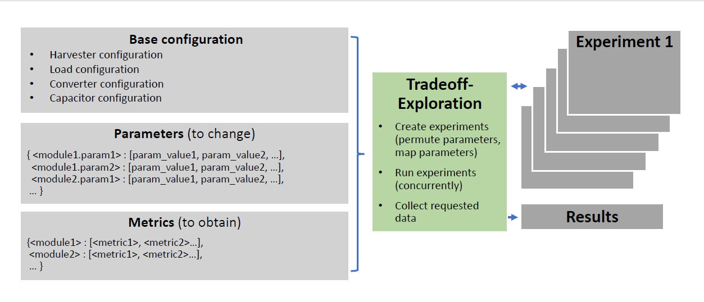

The *trade-off exploration tool* - as shown below - allows to automatically run simulations in a certain (user-defined) design space and retrieves the requested performance metrics from the module's logs. 



More specifically, the users specifies:

- a base configuration (of each module) 
- an arbitrary number of design parameters (of any module) to explore[^1]  
- an arbitrary number of performance metrics (of any module) to retrieve[^1] 
[^1]:Parameters and metrics are not restricted to a single module: iterating over any component/parameter combination is possible.*
	
The trade-off exploration tool then 

- permutes the specified parameters
- sets up the simulation core accordingly
- runs all the simulations concurrently (i.e., using multiprocessing, to speed up the exploration process)
- retrieves the requested performance metrics and provides them to the user
### Example

In this example, the number of successful checkpoints is retrieved for different settings of the checkpointing voltage threshold and capacitances[^1].

```
base_config = {'harvester' : harvest_config,
                'load' : load_config,
                'capacitor' : capacitor_config,
                'converter' : converter_config,
                'sim_time' : 10}
            
params = {'load.v_checkpoint' : list(np.arange(3.3, vhigh, 0.01)),
		  'cap.capacitance : [3300e-6, 5100e-6]'}
		  
metrics = [{'module' : 'load', 'params' : ['num_CHECKPOINT_successful']}]

result = run_tradeoff_exploration(params, metrics, base_config)
```


[^1]: For more details, refer to the paper and the simulation in [Simulations/get_gameboy_checkpoint_threshold.py](https://github.com/simbaframework/simba/blob/master/Simulations/Gameboy/get_gameboy_checkpoint_treshold.py).
