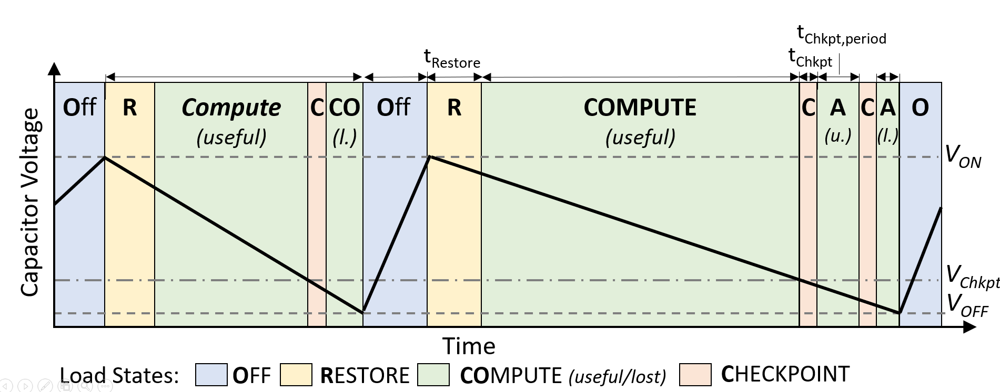

### Description 

The `JITLoad` module describes a load that uses a *Just-In-Time checkpointing* (JIT) approach to operate in the presence of power-failures (i.e., intermittently) according to the implementation in this [paper](https://dl.acm.org/doi/abs/10.1145/3411839).
The device starts performs periodic *checkpointing* (with a specific period, length, and current consumption), once the capacitor voltage passes a certain threshold ($V_{Chkpt}$), turns off at $V_{OFF}$ and *restores* the checkpoints after recharging to $V_{ON}$ (with a specific period, length, and current consumption). In between, while *computing*, the device consumes a configurable constant current.




### Parameters
| **Parameter** | **man./opt.** | **Value** | **Description** |
| ---- | ---- | ---- | ---- |
| `currents` | m | List of current consumptions in A | Map of current consumptions corresponding to each state, using the following format: {"RESTORE": Restore-current, "COMPUTE": Active-current,<br>"CHECKPOINT": Checkpoint-current} |
| `t_checkpoint` | m | Time in s | Duration of checkpoint operation |
| `t_checkpoint_period` | m | Time in s | Period of checkpoint operation |
| `t_restore` | m | Time in s | Duration of restore operation |
| `t_restore_startup` | m | Time in s | Duration of first restore operation after boot |
| `v_checkpoint` | m | Voltage in V | Checkpoint voltage threshold to start checkpointing once the capacitor voltage goes below this value |
| `v_on` | m | Voltage in V | Turn-on threshold to enter restore operation once the capacitor voltage exceeds this value |
| `v_off` | m | Voltage in V | Turn-off threshold to disable load once the load voltage goes below this voltage (i.e., minimum operating voltage) |
| `log` | o | Boolean | Define whether *normal* logging (i.e., only if any state change happens) is enabled (Default: `False`) |
| `verbose_log` | o | Boolean | Define whether *verbose* logging  (i.e., at each update call) is enabled (Default: `False`, can be enabled for smooth plotting) |

### Example configuration(s)

```
load_config = {
    'type' : 'JITLoad',
    'name' : 'Battery-free Gameboy',
    'settings' : {  'currents' : {   'RESTORE' : 2.65e-3*0.97,
                                     'COMPUTE' : 3.28e-3*0.97,
                                     'CHECKPOINT' : 2.87e-3*0.97},
                    't_checkpoint' : 33e-3,
                    't_checkpoint_period' : 270e-3,
                    't_restore' : 255e-3,
                    't_restore_startup' : 255e-3,
                    'v_on' : 2.9,
                    'v_off' : 2.8,
                    'v_checkpoint' : 3.4,
                    'log' : True}
    }
```