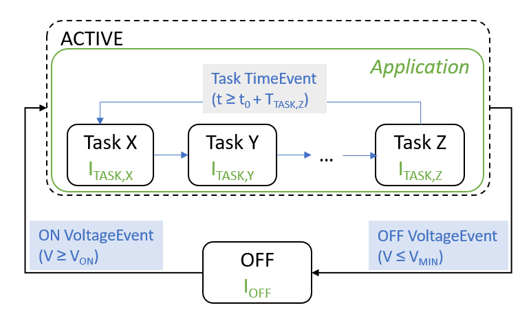

### Description 

The `TaskLoad` module describes a load that runs several tasks in a round-robin fashion (see Figure below). The tasks, their length, as well as their power consumption can be configured arbitrarily. As they can be modelled as fine-grained as required, the `TaskLoad` module allows to cover a wide range of different sensor node applications. The load further has a minimum operating voltage that is implemented as a hysteresis.




### Parameters


| **Parameter** | **man./opt.** | **Value**                | **Description**                                                                                                      |
|---------------|---------------|--------------------------|----------------------------------------------------------------------------------------------------------------------|
|     `tasks`     |     m         |  List of tasks  | List of tasks that should be executed in round-robin fashion, using the following format: {("TaskName": TaskDuration, TaskCurrent), ...}  |
|     `skip_initial_task`     |     o         |    Integer (0...NumTasks)   | Define whether the first n tasks in the list should be skipped in the round-robin scheduling (i.e., only execute them once after re-boot) (Default: 0) |
|     `v_on`     |     m         |   Voltage in V  | Min. operating voltage (turn-on threshold)   |
|     `v_off`     |     m         |  Voltage in V  | Min. operating voltage (turn-off threshold)  |
|     `i_off`     |     m         |     Current in A  | Current consumption if load is turned off   |
|     `shutdown_after_completion`     |     o         |     Boolean  | Define whether device should turn itself off (i.e., instruct the converter to disable the supply voltage) after all tasks are completed (Default: `False`)   |
|     `log`     |     o         |    Boolean   | Define whether *normal* logging (i.e., only if any state change happens) is enabled (Default: `False`)  |
|     `verbose_log`     |     o         |    Boolean   | Define whether *verbose* logging  (i.e., at each update call) is enabled (Default: `False`, can be enabled for smooth plotting)  |

### Example configuration(s)

```
load_config = {
    'type' : 'TaskLoad',
    'settings' : { 'tasks' : [{'name': 'INIT',  't' : 2e-3,   'i': 600e-6},
                              {'name': 'TASK1', 't' : 10e-3,  'i': 2000e-6},
                              {'name': 'TASK2', 't' : 100e-3, 'i': 500e-6}],
                    'skip_initial_task' : 1,
                    'v_on' : 1.9,
                    'v_off' : 1.8,
                    'i_off' : 1e-6,
                    'log' : True}
    }
```