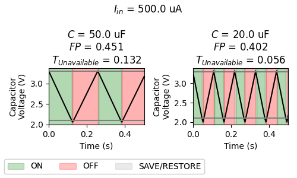
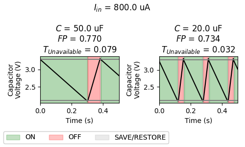

## Simba: Simulation Framework for Battery-Free Systems

*Simba* is an open-source simulation framework that allows to explore and facilitate the design of battery-free systems.

The design of battery-free systems (i.e., embedded devices powered by energy harvesters) is complex, as these devices cover a huge design space, exhibit non-trivial energy-driven dependencies between their different components, and are typically hard to debug, verify, evaluate, and compare.

*Simba* enables a fast and easy simulation of battery-free devices by integrating different component models and datasets in a single simulation core, and can thus be used for both long-term simulations with real-world traces (i.e., to verify given designs) and short-term simulations with small time granularity (i.e., to explore design options and gain a better understanding of interactions between different components). 
### Features

- Python-based simulation framework for battery-free devices consisting of an energy harvester, a capacitor, converter(s), and a load.
- Modular architecture allows to integrate a variety of different models and datasets.
- Versatile logging possibilities.
- Support for small-scale simulations (e.g., arbitrary time resolution $\leq 1\mu s$) and long-term simulations (e.g., several weeks of real-world harvesting traces).
- Trade-off exploration tool that allows automatically run experiments and retrieve statistics, so to derive optimal parameters for a given application.

## Example Use Case

The following example highlights the dependencies between device components within battery-free systems based on an intermittently-powered device that employs [*reactive intermittent computing*](https://royalsocietypublishing.org/doi/10.1098/rsta.2019.0158) (also called *just-in-time checkpointing*).
#### Intermittent computing (IC)

If the incoming (i.e., harvested) current is smaller than the outgoing (i.e., load) current, the device cannot operate continuously, but *intermittently*. This means that the device repeatedly experiences power-failures and has to use state-retention mechanisms (i.e., checkpointing) to ensure eventual progress in its application. 

A *reactive IC* device does this by observing its capacitor voltage and triggering a state-saving operation just before a power failure (i.e., at a certain threshold $V_{Chkpt}$). After the save operation, the device turns off and waits until its capacitor is recharged (i.e., to a certain threshold $V_{High}$), turns on to restore its state and continues operating until a state-save operation is triggered again.

#### Exploring forward progress and reactivity 

The behavior (and efficiency) of such devices can vary significantly and depends on the chosen checkpointing parameters (e.g., $V_{High}$, $V_{Chkpt}$, checkpoint size, ...), but also on the employed device components (e.g., energy harvester, capacitor). To quantify the performance of intermittent computing devices, the following metrics can be used:

- **Forward progress ($FP$)**: Describes the time a device spends on useful work (i.e., computation) in relation to the total elapsed time (i.e., charging, checkpointing, ...).
- **Unavailability ($t_{Unavailable}$)**: Describes the time in which a device is *not* responsive, i.e., because of recharging or checkpointing activities.

Note that these metrics are competing with each other (the higher $FP$, the higher $t_{Unavailable}$) and thus, depending on the application, an appropriate trade-off must be found. For example, sensing application might favor a small unavailability (e.g., to capture events), while computation-heavy applications might favor forward progress.
$FP$ and $t_{Unavailable}$ are highly dependent on many device properties, including the capacitance and harvesting current.
#### Simulation example

To showcase this behavior, we simulate such a *reactive IC sensor node* using different capacitances ($C$) and harvesting currents ($I_{in}$) and retrieve the $FP$ and $t_{Unavailable}$ for each configuration[^1].
[^1]: This example is also available in the simulator repo under [Simulations/sim_example_iin_capsize.py](https://github.com/simbaframework/simba/blob/master/Simulations/sim_example_iin_capsize.py).

<figure markdown>
  
  <figcaption>Larger capacitances give a higher forward progress (due to smaller checkpointing overhead), but increase unavailability because of longer charging times.</figcaption>
</figure>

<figure markdown>
  
  <figcaption>Forward progress and unavailability are further affected by the harvesting current (as well as load current), which must thus be considered carefully for any given application.</figcaption>
</figure>

*Simba* allows to explore these dependencies and can help to verify whether designs can meet the application requirements. 

